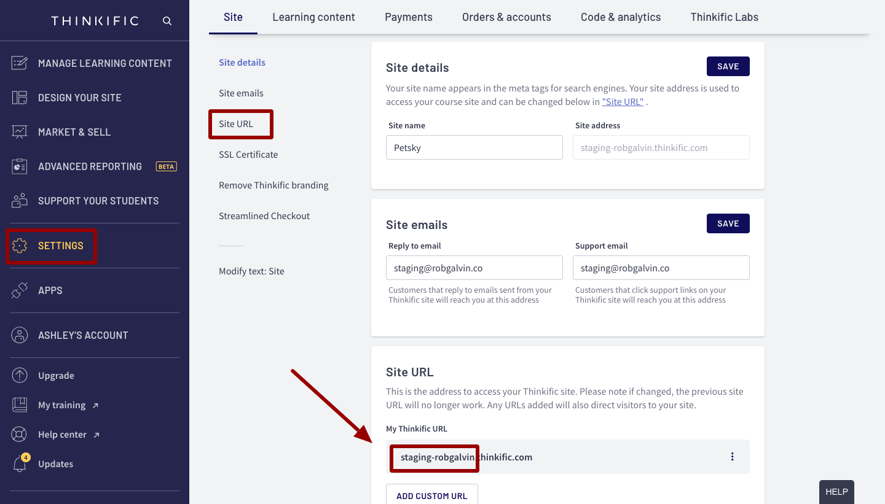
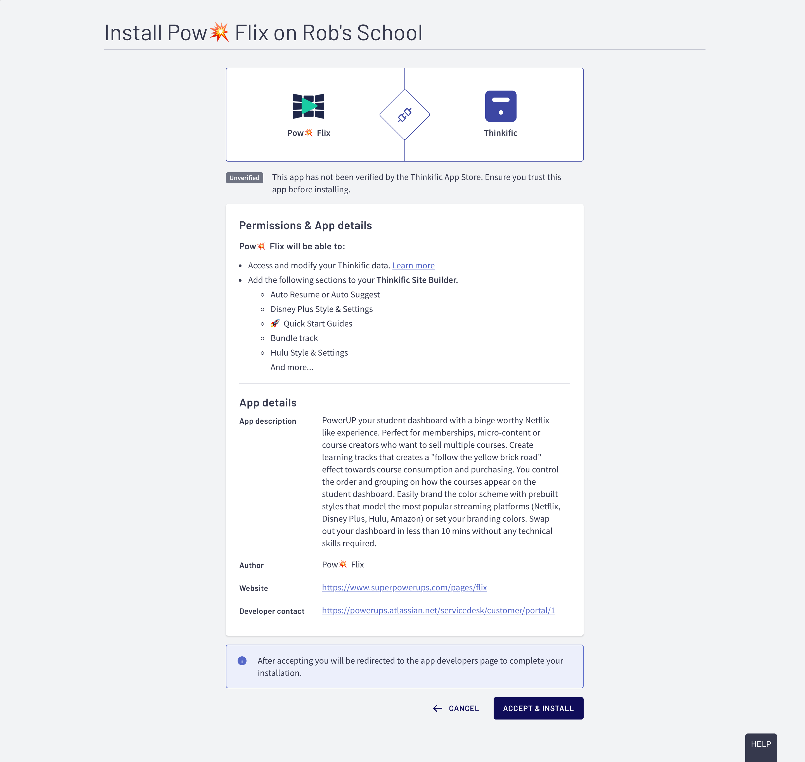

# Installing Flix


After your purchase Flix, you will be guided automatically through the steps below. But in case you got interrupted, the details are below. If you already installed Flix, then you can jump directly to the Activation steps


### Before Installation: Create an account and purchase Flix

Flix **does not require a monthly subscription.** We do however require you to create an account on [the SuperPowerUps.com site ](https://www.superpowerups.com/)and purchase Flix before you can install it into any site. Once you have a SuperPowerUps Account, you will also be able to quickly access any other PowerUp that you have purchased.


Be sure to have your Thinkific Site Admin login details handy in order to install PowerUps into your site.


### STEP 1: Login as a Site Admin & Locate your Thinkific Subdomain

### STEP 2: Enter your Subdomain on the Installation Page

Once you have your subdomain for the Thinkific site you wish to install plaYEAH! on, head over to the [activation page on the member portal](https://www.superpowerups.com/pages/flix-activate).


During the **purchase process you will already be directed to this page automatically after purchase**. You should also be already logged in to the member portal at this time, but in case you need to revisit the page, or if you were rudely interrupted :triumph: during the process, you can restart the process by just logging back into the [member portal](https://powerups.thinkific.com/enrollments).


### STEP 3: Accept the App Installation

After entering your subdomain, you will see a screen that looks like below. Be sure to click on the **ACCEPT & INSTALL** button. :point\_down: It's that big dark blue-ish / purple-ish button at the bottom of the page


Flix does not actually use any API's or access any of your Thinkific site data. Currently Thinkific's app screen that you see above is the same for all applications. The clause noted "Access and modify your Thinkific data" is applied to all Apps by Thinkific, however Flix does not use any such requests.&#x20;


### :boom: POW - You just installed Flix - Now it's Time To Use It

After installing Flix, nothing actually changes and your current student experience is not effected until you decide to activate Flix on your student dashboard.

#### Head over to the [QuickStart Activation Guide](../activating-flix/activating-flix.md) to start using Flix
