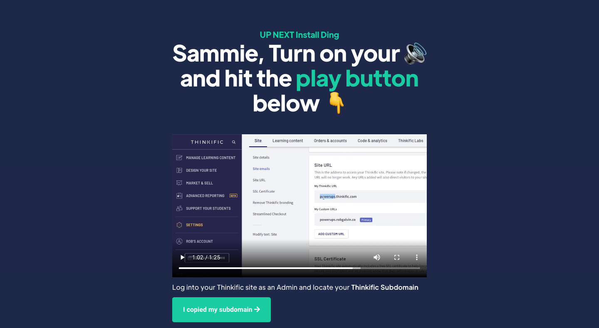
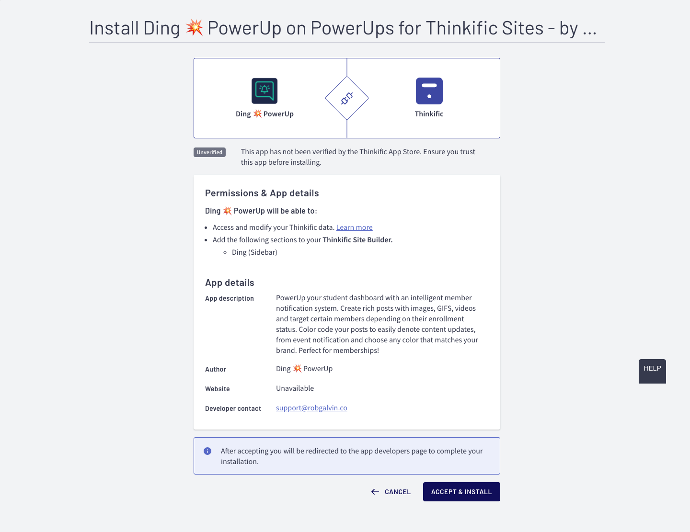

# Installing Ding

### Before Installation:  Create an account and purchase Ding

Ding **does not require a monthly subscription.** We do however require you to create an account on [our Thinkific site ](https://powerups.thinkific.com/)and purchase Ding before you can install it into any site. Plus, you will also be able to quickly access any other PowerUp that you have purchased.


After your purchase you will be able to install the Ding app from the [member portal](https://powerups.thinkific.com/pages/playeah-activation).  Depending on the license that was purchased, you may be able to install this app on many Thinkific sites or just one site.



Be sure to have your Thinkific Site Admin login details handy in order to install Ding into your site.


### STEP 1: Login as a Site Admin & Locate your Thinkific Subdomain

.png>)

### STEP 2: Enter your Subdomain on the Activation Page

Once you have your subdomain for the Thinkific site you wish to install Ding on, head over to the [activation page on the member portal.](https://www.superpowerups.com/pages/ding-install)


During the **purchase process you will already be directed to this page automatically after purchase**. You should also be already logged in to the member portal at this time, but in case you need to revisit the page, or if you were rudely interrupted :triumph: during the process, you can restart the process by just logging back into the [member portal](https://powerups.thinkific.com/enrollments).


### STEP 3: Accept the App Installation

After entering your subdomain, you will see a screen that looks like below. Be sure to click on the **ACCEPT & INSTALL** button. :point\_down: It's that big dark blue-ish / purple-ish button at the bottom of the page


Ding does not actually use any API's or access any of your Thinkific site data. Currently Thinkific's app screen that you see above is the same for all applications. The clause noted "Access and modify your Thinkific data" is applied to all Apps by Thinkific, however Ding does not use any such requests.&#x20;


###
