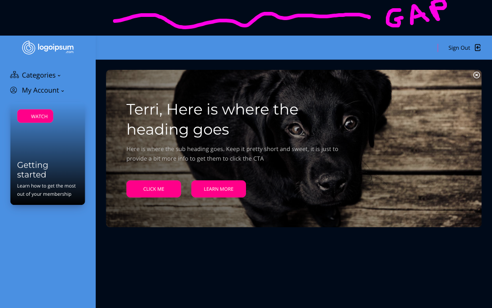

# Frequently Asked Questions

## How to get rid of the "flash" of old experience on the student dashboard or all courses page?


You will need to make this change any time you update the Thinkific theme in the future




## How do I make the font size larger in the Sidenav Menu? <a href="#who-is-the-creator-if-swiss" id="who-is-the-creator-if-swiss"></a>

Add the following code to your Site Footer Code settings: (yoursite..thinkific.com/manage/settings?section=site-footer-code#tab-code-analytics)\
\
The first line is the font size of the main text. The second line is the font size of the subtext. Adjust accordingly.

```
<style>
#catsmenu .sidebar__nav-link {
    font-size:18px;
}
#catsmenu .sidebar__menu a{
    font-size:16px;
}
</style>
```

## I have a large gap at the top of the page (when using Sidenav on Custom Pages) <a href="#who-is-the-creator-if-swiss" id="who-is-the-creator-if-swiss"></a>

<figure><figcaption></figcaption></figure>

This is coming from how Thinkific handles the normal navigation if you have the navigation set to "floating".&#x20;

To work around this, you can place this code into your site footer code settings (yoursite..thinkific.com/manage/settings?section=site-footer-code#tab-code-analytics)\


```
<style>
div[data-kapow-app="Sidenav"]{display:none;}
[data-menu-style="floating"] ~ .custom>div.sidebar{margin-top:0px;}
</style>
```

<figure><figcaption></figcaption></figure>

## Who is the creator if Sidenav? <a href="#who-is-the-creator-if-swiss" id="who-is-the-creator-if-swiss"></a>

Sidenav is just one of [the PowerUp's](https://powerups.thinkific.com/) (aka Thinkific apps) that are created by [Rob Galvin](https://www.robgalvin.co/) - who has been a certified [Thinkific Expert](https://www.thinkific.com/experts/site-creation-experts/rob-galvin/) for over four+ years. Rob and his team have been customizing Thinkific Site Experiences since 2016 (before there was "Site Builder", before there was "Page Builder" and before there was even an "Expert" program.)

Every day Rob and his team work on creating new ways to use Thinkific, creating hand crafted designs and user experiences that match the business and type of program being used on Thinkific _(it's not just for "courses" - we have done events, ambassador training, membership programs, corporate training, continuing education - you name it we have seen it.)_

**Up until now, only select business had the opportunity to work 1 on 1 with us**. But now, with Thinkific's "App Store" model - we are able to easily package up all of our **"ninja tricks"** 🧙 that we are creating for our clients (who handsomely pay us thousands of dollars) into what we call PowerUps.

## What in the world is a "PowerUp" <a href="#what-in-the-world-is-a-powerup" id="what-in-the-world-is-a-powerup"></a>

A PowerUp is a collection of new Site Builder sections that will give you new designs, features and abilities. Technically they are called "Theme Extensions" - this is different than the "custom themes" we create for clients. "Theme Extensions" allow you to stay up to date with Thinkific's theme updates while preserving and not losing any of the PowerUps you have installed and setup.

And the best part is, once you install a PowerUp:

* You get to keep it forever 📆 (as long as you do not uninstall it)
* When we update it ⚡ - you get the updates (for free and without having to click any buttons)
* You can use you new super powers 🦸 on any page (unless we tell you otherwise)

## How is this different than [Flix](https://www.superpowerups.com/pages/flix)? <a href="#what-in-the-world-is-a-powerup" id="what-in-the-world-is-a-powerup"></a>

Flix and Sidenav are completely two different PowerUps - they are really not meant to work together. Both are meant to provide an alternative student dashboard and all courses page experience.

Main differences between Sidenav & Flix

* Sidenav has a side navigation menu and Flix does not have a navigation menu
* Sidenav uses all up & down scrolling, where Flix has left and right scrolling
* Sidenav uses categories purely to decide what courses to be displayed, Flix allows both bundles and categories
* Sidenav navigation is the "main attraction" and allows you to link to other content, group your menu links into categories and subcategories. Flix allows you to present your courses in "tracks" just like popular streaming platforms (keep in mind that people have "problems" with carousel navigation
* Sidenav has advanced search and blazing fast filtering of course statuses. Flix currently does not offer search or filtering

We generally recommend that you use Sidenav over Flix unless you "must have a streaming looking experience"

## I am using 3rd party pages for my course landing pages, can I still use Sidenav on the all courses page?

When you use Sidenav on the All Courses page, the default link for the course cards will be the course landing page. If you are not using the course landing pages on Thinkific and have them hosted elsewhere, then you should use the [**Swiss Redirect Always Powerup**](https://docs-swiss.superpowerups.com/super-power-settings/redirect-always) (purchased seperately or included as part of the [PowerUp Pass membership](https://www.superpowerups.com/cart/add\_product/1203767?price\_id=1364633)). You would then add this redirect on all of your course pages so that the user will get redirected to your actual sales page.

## Do I need any technical skills? <a href="#do-i-need-any-technical-skills" id="do-i-need-any-technical-skills"></a>

Nope. These PowerUps are created especially for those who are not technical. All settings are exposed via Site Builder.

## Do I need to pay a monthly fee? <a href="#do-i-need-to-pay-a-monthly-fee" id="do-i-need-to-pay-a-monthly-fee"></a>

Nope. You can buy this power up and pay once => keep forever. Or if you want to swipe all of our PowerUps, you can get a PowerUp pass for a year for $399.

## Do I need to learn another platform / app? <a href="#do-i-need-to-learn-another-platform-app" id="do-i-need-to-learn-another-platform-app"></a>

No, you will not need to remember another login. Everything will accessible and easy to use inside of Thinkific's Site Builder.

## How much would it cost if I paid a developer to do this? <a href="#how-much-would-it-cost-if-i-paid-a-developer-to-do-this" id="how-much-would-it-cost-if-i-paid-a-developer-to-do-this"></a>

It would easily cost several hundred dollars just for this PowerUp - In fact, our clients are paying us several thousand dollars to create similar experiences for them. $399/year is a steal for the PowerUp pass.

## Can I still get Thinkific theme updates? <a href="#can-i-still-get-thinkific-theme-updates" id="can-i-still-get-thinkific-theme-updates"></a>

Yes, this new "App" model allows you to install theme extensions like this PowerUp and still be able to update Thinkific updates without losing anything.

## Can I really keep this forever? <a href="#can-i-really-keep-this-forever" id="can-i-really-keep-this-forever"></a>

Once you install it into your Thinkific site. It is yours to keep forever. And if you are a PowerUp Pass member, you will still be able to use it after you cancel your subscription.

## Can I set this up without effecting existing members? <a href="#can-i-set-this-up-without-effecting-existing-members" id="can-i-set-this-up-without-effecting-existing-members"></a>

Yes, although it only takes a few minutes to setup - you can play around and set it up before making it live for your members.

## What do I need to use this? <a href="#what-do-i-need-to-use-this" id="what-do-i-need-to-use-this"></a>

You must be on a current "Site Builder" theme and have an active paying subscription with Thinkific.

## Can I use this if I am on a Free plan? <a href="#can-i-use-this-if-i-am-on-a-free-plan" id="can-i-use-this-if-i-am-on-a-free-plan"></a>

Currently No, Thinkific does not allow app's to be used on a free plan. Anything above a free plan will work.

## What happens after I purchase? <a href="#what-happens-after-i-purchase" id="what-happens-after-i-purchase"></a>

After you create an account and submit payment, you will be instructed to install the Power Up into your Thinkific site. You will then be able to access helpful videos on how to set it up.

## Will this PowerUp be updated in the future? <a href="#will-this-powerup-be-updated-in-the-future" id="will-this-powerup-be-updated-in-the-future"></a>

Yes. In fact, if you are a PowerUp Pass member, you will be able to request tweaks. Occasionally we will release an update that contains all requests and they will be instantly available to you.

## Can I use this on multiple sites? <a href="#can-i-use-this-on-multiple-sites" id="can-i-use-this-on-multiple-sites"></a>

You can use this on multiple sites if you have purchased an Agency license.

## Will you set this up for me? <a href="#will-you-set-this-up-for-me" id="will-you-set-this-up-for-me"></a>

It is drop dead easy to setup and use in a matter of minutes. And with the helpful videos, I am practically right behind your shoulder guiding you. Sorry, this is DIY.

## With a PowerUp Pass I can basically swipe all of the PowerUps? <a href="#with-a-powerup-pass-i-can-basically-swipe-all-of-the-powerups" id="with-a-powerup-pass-i-can-basically-swipe-all-of-the-powerups"></a>

Crazy isn't it? If you paid for the [PowerUP Pass](https://www.superpowerups.com/cart/add\_product/1203767?price\_id=1364633), installed all of the PowerUps and then cancelled, you would still have the PowerUps available to you - even future updates.

## Why is this so inexpensive, when your clients are paying thousands of dollars? <a href="#why-is-this-so-inexpensive-when-your-clients-are-paying-thousands-of-dollars" id="why-is-this-so-inexpensive-when-your-clients-are-paying-thousands-of-dollars"></a>

I am taking much of the value I provide to my 1-on-1 clients and packaging them up for the rest of the Thinkific community to benefit from. Just call us "Rob"in Hood.

## Can I request any customizations? <a href="#can-i-request-any-customizations" id="can-i-request-any-customizations"></a>

If you are a PowerUp Pass member, you can request tweaks to any PowerUp. We will review requests on a regular basis and update or create new PowersUps for you and other members.

## Can I use this with a custom theme? <a href="#can-i-use-this-with-a-custom-theme" id="can-i-use-this-with-a-custom-theme"></a>

You will be able to install this if you are using a custom theme. Most if not all sections should work, but are not guaranteed to if you are using a custom theme.
