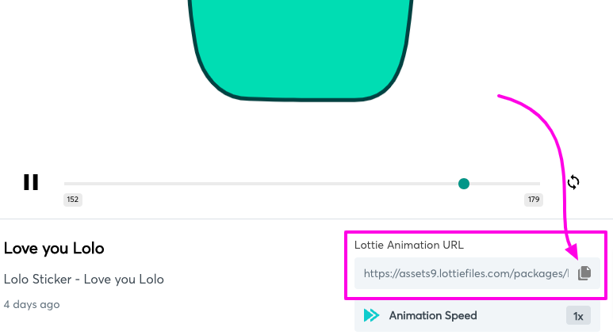

# 📋 "How To" Guides


You will not see how the player looks from the curriculum preview page. You must view the snippet from the course player. If you are adding or changing existing lessons on a live course, you may want to keep the lesson in draft mode until you are happy with all of your changes and then turn off draft mode to make the lesson available to your students


## How to Create a My Snips Page

We will use Thinkific's Site Builder to create a custom page that will store all of our Player Snips that we will want to use for our courses. You will then be able to copy and paste these Player Snips into the course lessons without having to edit and code.

* [ ] **Create a custom page** inside your site that will be used as your own personal library of Player Snips
  * [ ] Go to `Design your Site / Site Pages`: _yoursite.thinkific.com/manage/site\_pages_
  * [ ] Click `"New Custom Page"`
  * [ ] Enter a name for the page that you will remember. For example: _My Player Snips_
* [ ] **Remove the default Banner section** on the page
* [ ] **Change the page permissions** so that only you can view the page
  * [ ] Click on the `gear icon`
  * [ ] Change the `Who can see this page?` setting to "_Only Me_"
* [ ] Add a section and search for **Player Snips Builder**

<figure><figcaption></figcaption></figure>

* [ ] **Add a Player Snip section** to the page by searching for `Player Snips`. To quickly filter the list for certain types of Player Snips, search for the following
  * [ ] [Layout Snips](the-snips/layout-snips/): **`CL-`**&#x20;
  * [ ] [Effects Snips](the-snips/effects-snips/): **`ES-`**
  * [ ] [Popup Snips](the-snips/popup-snips/): **`PU-`**
  * [ ] [Content Snips](the-snips/content-snips/): **`PS-`**

<figure><figcaption></figcaption></figure>

<figure><figcaption></figcaption></figure>

* [ ] Go into the individual **Player Snip section settings** and change the options based on your preferences. Each Player Snip will come with a different set of configuration options.
* [ ] **Hover over the Player Snip to access the actions available** for that snip. For snips that are not visible (like popups or effects), you will be able to trigger the snip using the action buttons so you can preview how it will look. There is also an action button that will take you to the snip's user guide.
* [ ] When you are satisfied with how your Player Snip looks or behaves, then **hover over the Player Snip and click on the `Copy Player Snip` button**

<figure><figcaption></figcaption></figure>

* [ ] **Go into a text setting inside your course curriculum** (Text Lessons, Text Under Video, etc)
* [ ] Put your cursor in the position that you wish to place the Player Snip and then **go into the code view** mode by clicking on the `< >` button
* [ ] **Get out of code view** and save the lesson
* [ ] **Preview the current lesson** inside the course player


If you are other content around the Player Snippet, it is sometimes helpful to temporarily "mark" the areas around the player snippet, so when you return to the normal preview view, you will know where the Player Snip is located in the full area.


## How to generate links for downloads, mp3's, etc

In some cases you may want to use the Player Snips to link to some sort of download. When you are using the Player Snips builder in the "My Snips" page, the section settings will give you a way to provide a link, but it does not provide a way to upload a new file. In order to use it this way we recommend that you create a draft lesson in a course and then copy and paste the link into the My Snips section settings:

* [ ] Create a dummy lesson that is a Download lesson type&#x20;
* [ ] Keep it draft and it can also be in any course&#x20;
* [ ] Upload your files to the Download lesson
* [ ] Then preview the lesson in the course player
* [ ] Locate your file in the list of downloads and then right click to copy the link
* [ ] Then use this link in the Player Snip as a "Custom Url"

## How to use Animations within Player Snips

Our Player Snips that have animations like the Popup Animation Bar require a url to a JSON animation. You can Google where to get these, but we love [LottieFiles](https://lottiefiles.com/)

#### How to get a Lottie animation url

* [ ] Create a free account over at [https://lottiefiles.com/](https://lottiefiles.com/)
* [ ] Search for a free Lottie animation&#x20;
* [ ] Select a Lottie and then copy the  Lottie Animation Url to your clipboard
* [ ] Paste in the Lottie Animation Url into the Player Snip settings

<figure><figcaption></figcaption></figure>

