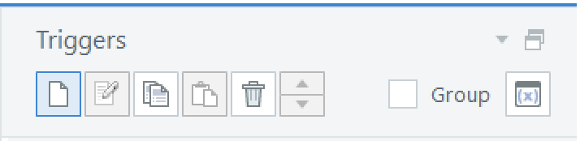
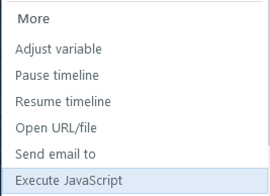
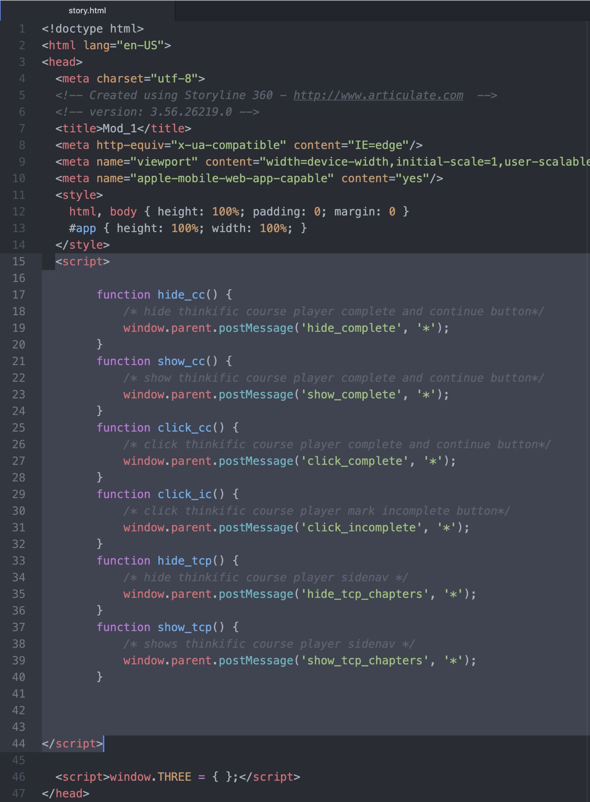
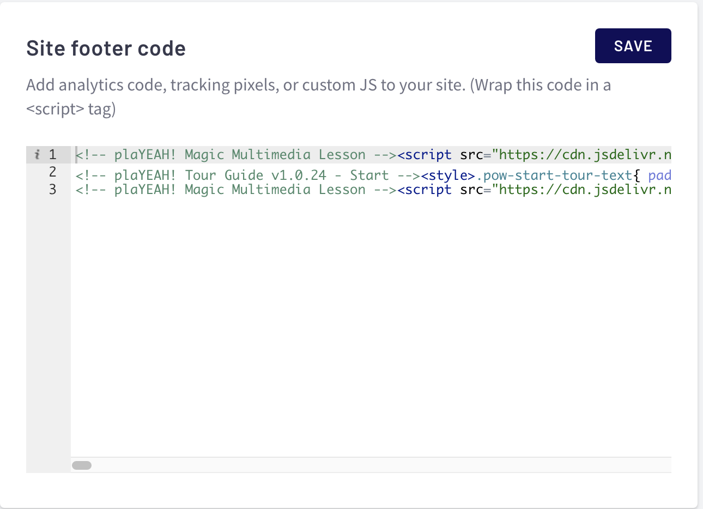

# Magic Multimedia Lesson

In order to use this, you must understand how to call a Javascript function from within your authoring tool (Storyline, etc). Please do not contact support for instructions on how to do this from within your tool. What is being provided here is a way for your multimedia lesson html to be able to issue a Javascript message to a snippet of code from plaYEAH! that will be listening for certain messages to perform operations like hiding or clicking the complete and continue button.

### Step 1: Place the JavaScript into your .story file

1\) Open your .story file to the slide that has the button you want to activate the JavaScript code and select the button. <mark style="color:red;">**You must use a button to activate the JavaScript**</mark>


2\) **** In the Triggers panel, create a new trigger.



3\) Choose Execute JavaScript in the JavaScript popup window and choose your button (if it isn’t already chosen.)



Click on the JavaScript link that appears in the box and copy/paste the following (this will turn off the “Complete” button):

```
window.parent.postMessage('hide_complete', '*');
```

4\) Save your trigger and move it above any other triggers for the button that already exist.

5\) Save your slide.

6\) Open the slide that contains the button you want to use to turn the “Complete” button back on. Repeat the process, but this time the JavaScript you will use is:

```
window.parent.postMessage('show_complete', '*');
```

### Step 2: Place JavaScript into your story.html file

1\) Export your Storyline document for Web by clicking Publish > Web. Find your exported files. Within the exported files folder that is created you will see a story.html file. Open this file using a text editor. I use Atom, but here is a list you might want to choose from.&#x20;


**Do not use MS Word** or any other kind of word processing program: Sublime Text Atom Notepad++ CoffeeCup – The HTML Editor TextMate Vim UltraEdit Coda BBEdit Komodo Edit Visual Studio Code Brackets CodeShare


Once you have your story.html open, copy/paste the following code after and before at the top of the file. Save your file.

```
<script>
   
        function hide_cc() {
            /* hide thinkific course player complete and continue button*/
            window.parent.postMessage('hide_complete', '*');
        }
        function show_cc() {
            /* show thinkific course player complete and continue button*/
            window.parent.postMessage('show_complete', '*');
        }
        function click_cc() {
            /* click thinkific course player complete and continue button*/
            window.parent.postMessage('click_complete', '*');
        }
        function click_ic() {
            /* click thinkific course player mark incomplete button*/
            window.parent.postMessage('click_incomplete', '*');
        }
        function hide_tcp() {
            /* hide thinkific course player sidenav */
            window.parent.postMessage('hide_tcp_chapters', '*');
        }
        function show_tcp() {
            /* shows thinkific course player sidenav */
            window.parent.postMessage('show_tcp_chapters', '*');
        }
        
</script>
```


This code should go before any other JavaScript code that you might see, but after **`</style>. For Example:`**

**``**

\



### Step 3: Zip all of the files you will need for uploading to Thinkific

### Step 4: Place JavaScript code into the footer in your Thinkific account

1. Log into your Thinkific account.&#x20;
2. In the left sidebar, click on “Settings” In the panel that appears, choose the tab that says “Code & Analytics”&#x20;
3. Copy/paste the following code into the footer and choose&#x20;
4. Save

```
<!-- plaYEAH! Magic Multimedia Lesson --><script src="https://cdn.jsdelivr.net/gh/robgalvinco/pow@v1.0.19/playeah/event-manager.min.js"></script>

```


