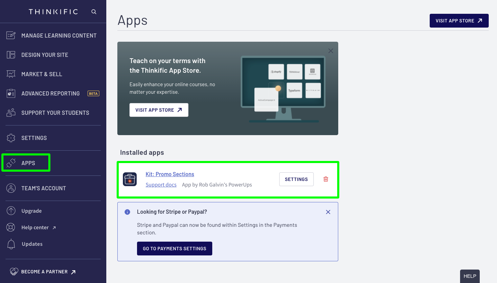

# Adding a Promo Super Power to a Page



### Step 1: Make sure you have Promo Kit installed

Check your app page inside of your Site Admin _ex: https://yourdoomain.thinkific.com/manage/apps_ and make sure you have **"Kit: Promo Sections" installed**. If it is not listed there, head back to the member dashboard and install it.

### Step 2: Add Base Kit to your page

Open up the page you would like to add a Promo section to and first add the "Base Kit Section". You can also copy a Base kit section from another page if you have one already created. [Be sure to read our guide on how Base kit works.](../kit-common-sections/base-kit.md)



### Step 3: Add a Promo Kit to the page

The Promo Kit comes with [many different types of super powers.](./) You can easily search for all sections by adding a section and **search for "Kit: Promo"** or you can search for a specific section to use by **searching for it's Kit Id **_**ex: Kit: Promo (01)**_



### Step 4: Update the Promo Section Settings

After you have added your Promo Kit section to your page, be sure to update the default settings to control the behavior, text, media, links, etc and configure it to the way you want it to look. Each section will contain its own settings. There will be consistency across all of the Kit collection by grouping the settings into common groups (ex; Headings, etc) _**Be sure to check the guide on the promo section you decided to use for any specific instructions.**_


