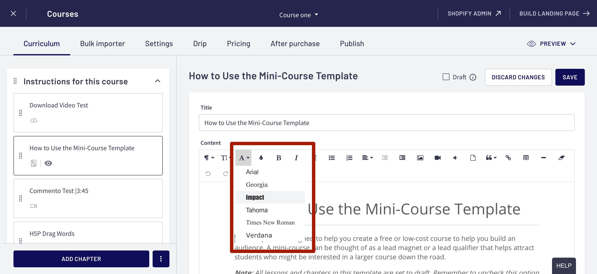

# Default styling for your text sections

In the [previous Quick Win](using-custom-fonts-inside-the-course-player.md), you added some custom fonts :abc: to the course player experience. This allowed you to **PowerUp your player** with your own branded look and feel. Yeah You! :bomb:&#x20;

Now it is time so save you your precious time :alarm\_clock: - so you do not have to pull your hair out with that WYSIWYG editor. over and over and over again.

## First things first - lets talk about Text Lessons WYSIWYG

What you see is what you get?!?! - sure, but **what if, what you don't want to see**?? You don't want to see _IMPACT or Times New Roman_ - sorry if you are a fan of these ancient relics. But even if you were - the moment you use these inside of the text editor is the moment of doom for you. You are essentially doing what's call "inline styling" - which basically should be "in-jail styling". It locks you into this style and the only way to update it is to jump through a :fire: few flaming hoops :lion\_face: to get it back to "normal".&#x20;

## Instead, just use Paragraph styling

plaYEAH!, meet your new friend. It's that **funny looking backwards P** in the upper left hand corner. Go ahead and select some text, then choose the backwards P and choose Heading 1.&#x20;

.png>)

Think of this as **a way to "name" things inside** of your text lessons. And now that you have the plaYEAH! Power Style Editor, you can do things like "Everything that has a name of 'Heading' 1, I want to use purple and the Dancing Script font.

Simply pop back into the My plaYEAH Style Editor Site Builder page [from the previous step](using-custom-fonts-inside-the-course-player.md) and change the 4 heading styles to use whatever font, color combination you would like to use.

.png>)


Ok, plaYEAH! - you just completed the **Power Style Quick Start section.**&#x20;

You now have some really awesome super powers under your belt :superhero:&#x20;


## :clipboard:Things you may want to do next

* :scales: Setup some [course specific styles](../course-specific-styles.md) so you can **turn off progress for your "not a course course"**
* View the [usage notes and resources](../usage-notes.md) for some helpful tips :mage:&#x20;
* Snag a :frame\_photo: screen shot of your plaYEAH! and post it in the [Thinkific Facebook group](https://www.facebook.com/groups/thinkific) - make sure you [tag @Rob Galvin](https://www.robgalvin.co/) so he can comment on your creation.
* Have a look at the [Changelog](broken-reference) so you can see what awesome features will be added to plaYEAH! or visiting the [PowerUp gallery](http://powerups.thinkific.com/) and see what other super powers you can gain.
