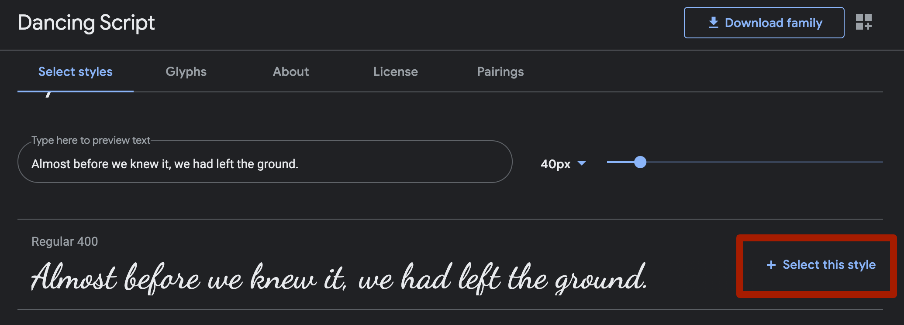
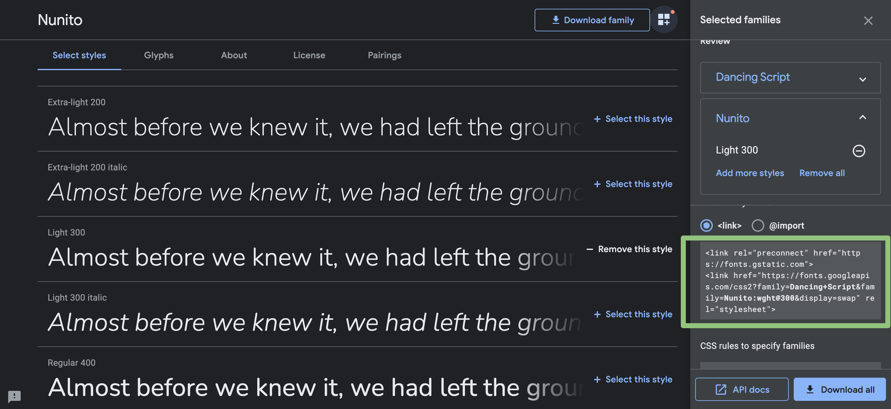

# Using custom fonts inside the course player

:fist: Time to PowerUp your student experience with your own set of fonts :fist:&#x20;

* [ ] Fire up another tab in your browser and go to [fonts.google.com](https://fonts.google.com/)
* [ ] Since we love [dancing alpaca's](broken-reference), let's search for **"Dancing Script" font and click on it.**

* [ ] You will then see a list of font styles. Scroll down and until you see **Regular 400.** Towards the right you will see **Select this style**

* [ ] Select and copy all of the text in the **section below \<link>**

.png>)

* [ ] ****:rotating\_light: **Keep that Google Fonts tab open, plaYEAH!** _we will be needing that in a second_. For now let's go back to Site Builder (you should already have another tab open) where we just styled our background color [from Quick Win #1 in the prevous step.](quick-start-guide.md) Head to the **Custom Fonts** settings box and paste that code snippet you just copied from Google Fonts.

.png>)

* [ ] We are almost there - just one thing left to do. **Now we need to assign that font to the places we want to use it.** First head back to that Google Fonts tab I told you to keep open just a few short moments ago (if you were not paying attention or accidentally closed it, then have no fear - just open a new tab and do it again). On the right side, right under the section we just were in - there is another area that says **"CSS rules to specify families"** :nerd: Just double click inside that area so it selects the text _**font-family: 'Dancing Script', cursive;** _ then be sure to copy it to the clipboard.

.png>)

* [ ] Now jump back to the previous browser tab that should still have Site Builder open. We are going to set the Heading styles for our text sections to use this font by opening the **Content Text** settings group and pasting it into the **Font Family H1** section. You should then also choose **Custom Color or Font** in the _Heading 1_ setting area..

.png>)


There are 3 settings for each heading type 1-4 and can be controlled independently.&#x20;

* **Drop down**: Choose _Custom Color or Font_ if you want to change the font+color otherwise it will use the default
* **Color**: Choose the color when _Custom Color or Font_ is selected, otherwise it will be ignored
* **Font Family:** This is where you would paste the font family name (_font-family: 'Dancing Script', cursive;_). This is only applied when you have _Choose Custom Color or Font ****_ setting.


* [ ] Why stop now plaYEAH!? Let's add a **second font family** for the _body text_ as well as the _Chapters and Lessons_ sidebar text. Head back to the Google Fonts tab (which I hope you did not close yet you happy tab closer you) Search for another font. This time search for Nunito. After you click **Select this style**, you will notice an icon in the upper right corner that you need to click. (It is right next to the **Download family** button)

* [ ] Select the code snippet that appears in section on the lower right as shown in the image below.

* [ ] Make sure you have **selected all of the text**


Keep the fonts.google.com tab open as we will need one more piece of info in a second.


* [ ] Now back in your[ Power Style Editor page](quick-start-guide.md#your-first-power-style) that we setup before, open the **Custom Fonts** section settings and paste the code in there. **This time replacing everything that is in there.**

.png>)

* [ ] Now let's go ahead and change our **Chapter/Lesson font to all use Nunito**. To do this, go back to the Google fonts and in the _CSS rules to specify families section,_ let's select and copy the text: **font-family: 'Nunito', sans-serif;** We only want to copy the second line.

* [ ] Once last browser tab jump, plaYEAH! to you know where - back to the Site Builder page. Scroll down on the left hand side and change open the **Chapter + Lesson Color** settings group.Select **Custom color & font** and then paste the CSS rule, that you just copied, into the **Font Family setting box**

.png>)

* [ ] Click the **Full Screen icon** in Site Builder so you can preview how it will look. If you already know this part from the [previous Quick Win](quick-start-guide.md) - then just skip on past the next few steps.

* [ ] Now click the **Copy Code** button in the upper right corner. This will copy the code snippet to your clipboard

* [ ] Click the **Site Footer Code** settings. This will open a new tab in your browser to the site footer code settings  page

.png>)

* [ ] **Paste the code snippet** into the code area and then click **Save**

.png>)


&#x20;:star\_struck: plaYEAH! your player got some new fonts! Nice job!.

**Pro Tip:** If you use a lot of "text lessons" or use "text under video" in your courses you know what a **pain in the you know where,** it is to have to create consistant style across all of these lessons. And heavens forbid, if you want to change colors or fonts, then you would have to spend a :poop: load of time changing that in every single course. Unless you know about the next Quick Win in your plaYEAH! super powers belt. :superhero:&#x20;

