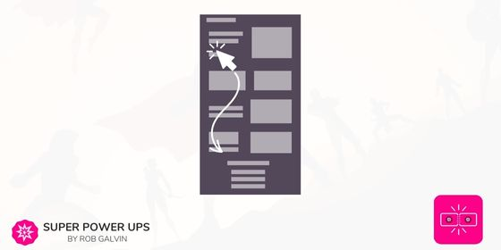

# Anchor Link

<figure><figcaption></figcaption></figure>

## How to use this section

* [ ] Add [Activation: Build Your Own](activation-build-your-own-section.md) section to a Site Page. _This section is required_
* [ ] Add this section to the page below the Activation: Build Your Own section and right above the section you want to create an "in page" link for.
* [ ] Go into the Achor Links settings and update the Hyperlink Anchor ID setting to be an id that you will use in a step below. Be sure to not include any spaces as they will be replaced by dashes. ex: _call-to-action_
* [ ] Copy the current page link to your clipboard by clicking on the page link icon (this is not the same link that you see in your browser as a Site Admin)
* [ ] Edit another section on the page that is using a link or a button. Choose the Custom Url option and then paste the page link into the setting.
* [ ] Move your cursor to the end of the line for the page url that you just pasted and add **#your-anchor-id** _ex: https://www.mydomain.com/pages/sales-page#call-to-action_

## Video Walkthrough


