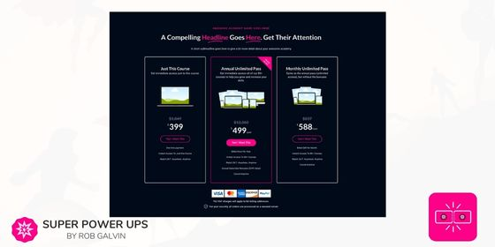

# Pricing Outlined Cards

<figure><figcaption></figcaption></figure>

## How to use this section

* [ ] Add [Activation: Build Your Own](activation-build-your-own-section.md) section to a Site Page. _This section is required_
* [ ] Add this section to the page below the Activation: Build Your Own section
* [ ] Adjust the section settings for your text and media
* [ ] Optionally adjust the colors in the Style & Colors settings group

## How To Walkthroughs:

### How to create a solid color card instead of an outline:

* [ ] Open up the Style & Colors
* [ ] Uncheck the setting for the card background default color
* [ ] Choose the background color you wish to use
* [ ] Uncheck and adjust the other color settings for the text so that is visible on the card


