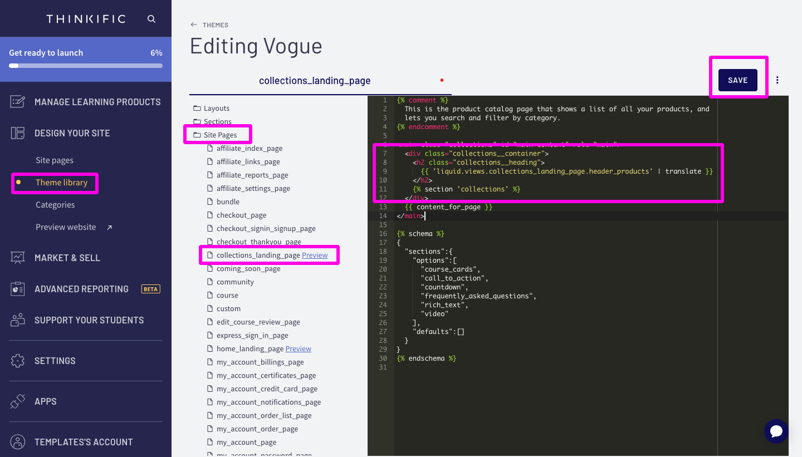

# All Courses Page (Category Images)

<figure><figcaption></figcaption></figure>

This full page template will over-ride the default all courses page design that is provided by Thinkific's themes. The banner section contains a search bar and the background image will change based on the category that is being viewed. You also have more control over the course card designs as well as how many are displayed. At the bottom of the page is a category card selector that contains a list of category image cards

## Removing the "Default" Section

When loading the All Courses page using this superpower, you may notice a brief flash of the "old all courses page". This is because Thinkific has decided to force their version of the All Courses page. To remove this "sub second flash", we will go into the theme code and remove just a few lines of code.



* [ ] Go to Design your Site / Site Themes&#x20;
* [ ] Click the three dots and click the "Duplicate" option - this will create a copy of your theme in case you need to "undo" what you did
* [ ] Click Edit Code
* [ ] Go to Site Pages / Collections Landing Page
* [ ] Remove lines 7-12
* [ ] Click Save

<figure><figcaption></figcaption></figure>
