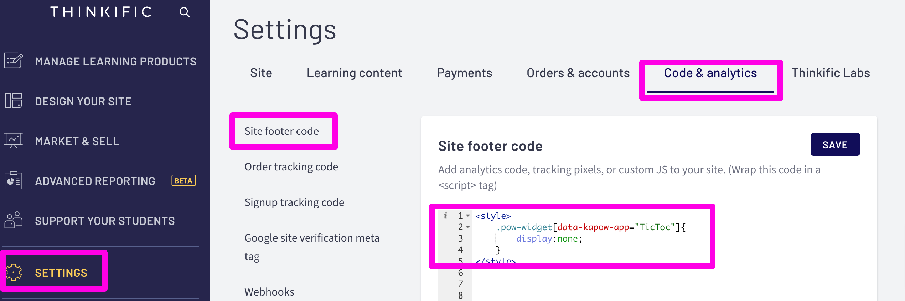

# Advanced Usage

## How to just display the card text:

In some cases you may not want to display the Expiring Courses Saver Widget, and only show the warning text on the card.&#x20;

To accomplish this, go to your Site Footer Code Settings: _yoursite.thinkific.com/manage/settings?section=site-footer-code#tab-code-analytics_\
__\
__and paste this code:

```
<style>
    .pow-widget[data-kapow-app="TicToc"]{
        display:none;
    }
</style>
```

<figure><figcaption></figcaption></figure>
