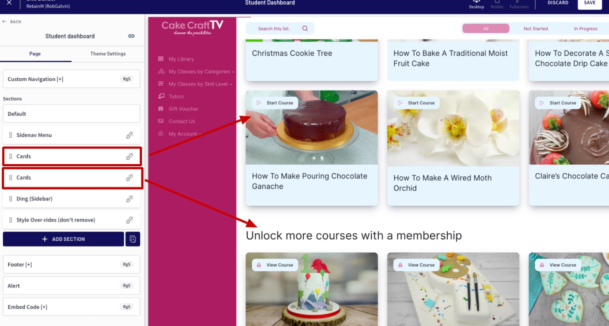

# Cards

The _**Cards**_ section is generally used on the All Courses Page or the Student Dashboard Page. You may also use it on any page you like, but be sure to set the _Section Type setting_ to something other than `Auto`You will need to add the _Cards_ section along with the Sidenav Menu on each page and configure them separately. While on the Student Dashboard page, clicking on a category link will automatically display courses for that category from the student dashboard. If the student is not enrolled in any courses for that category then none will appear.

In order to to see your courses appear, you must add a _**Cards**_ section to the page _after you have added the_ [_Sidenav Menu_](sidenav-menu/) _section._&#x20;


There can be more than one _Cards_ section on the page, but there should only be one Course Card section that has a Section Type = Auto


After adding the _**Cards section to your page,**_ you will be able to configure:

* The type of section this is
* Text used in the heading part of the section
* Text used for the filters part of the section
* Card style, and text used on the course card

.png>)

## Managing the section type

In some cases you may want to have multiple _Card sections_ on a page. For example, let's say you have a membership with a free trial. For free trial users, you would want to "tease" the content they are missing by adding a section Cards section that is set to upsell them to the membership bundle.



### Section Type: Auto generated cards

This type is only used on the All Courses and Student dashboard pages and on these pages, you should always have one of the _Cards_ sections added to the page.

* [ ] Open the _**Section Type** _ settings group and make sure the _section type setting_ is set to **Auto**
* [ ] When used on the student dashboard page, the users enrolled courses will be shown&#x20;
* [ ] When used on the all courses page, the public courses will be shown

.png>)


The Auto section type will always appear above any other _Cards section_ you may have added to the page and also will always appear below any _Sidenav Banner (Slider)_ section


### Section Type: Upsell Bundle&#x20;

This type is used to display a list of courses in a bundle with the intention of "teasing" content that the user does not have. _Ex: You want to upsell individual courses or you want to upsell a membership bundle._



* [ ] Open the _**Section Type** _ settings group and make sure the _section type setting_ is set to:
  * [ ] &#x20;**Upsell Bundle (Any):** Only courses that the student is not enrolled in will show. If they are enrolled in all of the courses in the bundle, then this section will not be shown.
  * [ ] **Upsell Bundle (All)**: This section will only show if the student is _not enrolled in all of the courses in the bundle_
* [ ] Choose the bundle in the **Upsell Bundle** setting. (The bundle does not have to be published). Make sure you have courses added to your bundle
* [ ] Set the **Link Type** to _Course Landing_ if you want the cards to be linked to the course landing page
* [ ] Set the **Link Type** to _Other page_ if you want the cards to be linked to a different page. Then set the **Other page** setting to the page you would like the cards to be linked to.
* [ ] Also be sure to set both the **Default Heading** and **Category Heading** for this section

.png>)


The filter settings are ignored for this type of section as a filter and search is not added to the section, only the cards will appear.&#x20;



## Managing the section headings

This setting group allows you to manage the text that appears on the section. Keep in mind that this&#x20;

* [ ] Open the _**Section Headings**_ settings group
* [ ] Change the _**Default heading**_ setting to control what text appears initially when the page loads
* [ ] When viewing a category or subcategory page, make sure the _**Category heading**_ setting includes the SmartText: _**\[AUTO]**_ so that it shows the name of the category. You can decide if you want to append or pre-pend it with other text. example: _\[AUTO] Courses => Dog Training Foundation Courses_
* [ ] Set the _No results_ setting to include the text you wish to display when a category or search result has zero course cards to display

.png>)

## Changing or disabling the filter default text

You may wish to change the default text used in the course search and filter section of the page

* [ ] Open up the _**Filter Headings**_ setting group and update the text that you wish to use
* [ ] Optionally disable this section by unchecking the **Show filter headings** box



The filter options are only available on the Student Dashboard. On the All Courses page, the search will still be available.


## Card Style & Text Options

There are a few different styles of course cards available and you also have options to change text that will appear along side your course card image.

### Text Overlay Card Style&#x20;

This card style is great when you have a picture for a card that gives a visual clue to what the course is about. It will use your course card image as a background and automatically crop the image to fill the space based on the height of the card you choose. It will also overlay the name of the course along with a gradient fill so that the course name stands out.

.png>)

* [ ] Open the _Cards settings group_ and change the _**Style Type**_ setting to _**Text Overlay**_
* [ ] You can also change the course _card height_ by using the _**Text Overlay Card Height**_ setting

.png>)


When using the Text Overlay card style, the course card image will "fill" the entire area of the card. Depending on the card size, your image may be cropped. If you are using course card images that have text "in the image", then you probably want to use the Image Only option below


### Text Under Image Card Style

If you want a more traditional card style, you can choose the Text Under Image setting and have the course card image appear above the course name. You can also optionally add the course description to the card as well.

.png>)

* [ ] Open the _Cards settings group_ and change the _**Style Type**_ setting to _**Text under image**_
* [ ] You can also change add the course description to the card by checking the _**Show course description**_ setting

.png>)


When using this option, the image will be shown in its entirety.


### Image Only Card Style

Image only cards are perfect when your image already has the course name. Usually this is done to make your names more interesting on the card image. In this case, you most likely want to use the Image Only option.


* [ ] Open the _Cards settings group_ and change the _**Style Type**_ setting to _**Image Only**_

.png>)


When using this option, the image will be shown in its entirety.&#x20;


## Card Badge Settings

The "badge" is an overlay on top of the image to have an icon and some text to help the user make a decision on what to do. You can control the location of the badge as well as if you want to hide them completely. You can also change the text that appears as well.

.png>)

* [ ] Choose the location of the badge by selecting the _**Badge Type** setting_
* [ ] If you do not want to use this, then choose _**None**_

 (1).png>)


_**Bottom Left**_ and _**Bottom Right**_ are not supported when the Card Type is _**Text Overlay**_


* [ ] To change the text that appears on the badge, update the text for the various conditions that the course could be in


## Card Link Settings

In some situations, you may want to have your course cards that are displayed on the Student dashboard to go to your course landing page instead. You can change the link that is used by changing the _**Link Type (Dashboard)** setting_


* [ ] To have the course cards go directly into the course, choose _"Resume"_ for the _**Link Type (Dashboard)** setting_
* [ ] To have the the course cards go to the course landing page, choose "_Landing_" for the _**Link Type (Dashboard) setting**_


This setting is only available on the Student Dashboard page with an section type setting of Auto


### Advanced Style Tweaks

#### Card Badge Color Changes

Add a Swiss Embed Code to the page and then paste this code snippet to change the color and font behavior of the badge that appears over the course cards

.png>)

```
<style>
    /* Card badge */
    .cards-section .cat-course-card .post__video {
        background-color: #FF0089;
        color: #FFFFFF;
        font-family: 'Montserrat', sans-serif;
    }
    /* Card badge icon*/
    .cards-section .cat-course-card .post__video i{
        color: #FFFFFF;
    }

    /* Hover */
    .cards-section .cat-course-card .post__video:hover {
        background-color: #FFFFFF;
        border-color:  #FFFFFF;
        color: #FF0089;
    }
    .cards-section .cat-course-card .post__video:hover i{
        color: #FF0089; 
    }
</style>
```
