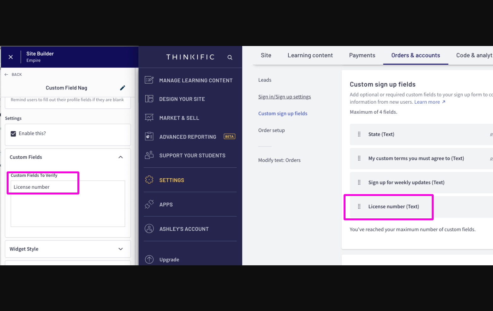

# Custom Field Nag

Use this super power if you are using custom profile fields and you want to ensure your members fill them in.


Since Site Builder doesn't recognize who is signed in, you may not see the popup inside of Site Builder, but you can preview this on the actual student dashboard page.




### How to use this super power

1\) Make sure you have Ding installed

2\) Open up Site Builder and navigate to your Student Dashboard page

3\) Add the `Custom Field Nag` section from Ding

4\) Add the names of your custom fields into the `Custom Fields to Verify` setting&#x20;

5\) Choose your `widget style`

6\) Update your `headings` to specify the message you would like to display

7\) Update the `Call to Action` to specify the button text

8\) If your widget style requires an image, update the `Popup image` settings

9\) Update the `widget location` to display the message in the location you desire

10\) Update the `widget visibility` to control when it appears

11\) Enable or disable sound in the `sound settings`


The custom fields need to match exactly what you have configured in your yoursite.thinkific.com/manage/settings#custom-sign-up-fields page. When you add more than one field, be sure to keep each field name on one line. We will check to see if all fields are non-blank

