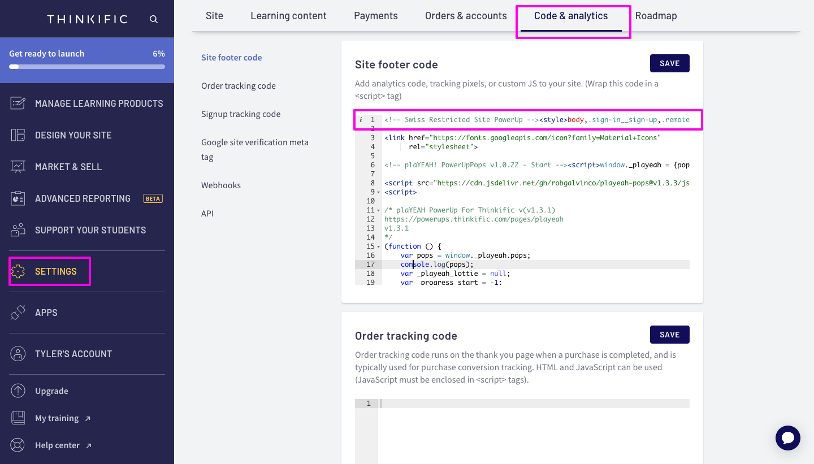

# Restricted Site



## How to use this superpower:

* [ ] Open up your Sign Iin page from Site Pages
* [ ] Add the "Restricted Site" section to the page
* [ ] Follow the instructions provided.&#x20;
  * [ ] Copy the code snippet shown on the page to your Site Footer Code settings page
  * [ ] Click Save to restrict the entire site
* [ ] Adjust the Sign In Page subheading and Heading settings

<figure><figcaption></figcaption></figure>

## How to remove this superpower:

* [ ] Navigate to your Site Footer Code settings page and remove the Swiss Restricted Site code snippet, then click Save

