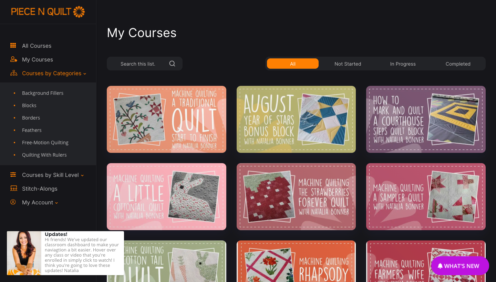

# Creating Navigation Links

One of the biggest super powers Sidenav has, is the ability to create a very rich navigation experience for your members. Depending on how your site and courses are organized, you may be able to set the navigation up in different ways:

* Support for both links on the side menu and top menu
* Links to pages or categories using icons for more visual appeal
* Create a two-level navigation structure to group items (ex: subcategories)
* Callout "special" content types more easily to remind your members that you have "more than just courses"

## Creating Sidenav Menu Page Links

You can add links to any pages that you want to highlight on the Sidenav Menu&#x20;

.png>)

* [ ] Add a _**Link or Category block setting**_ to the page
* [ ] Choose _**Link (Page)**_ for the _Type setting_
* [ ] _Copy and paste an icon to use from Font Awesome_ (5.0 Pro version supported) into the _Icon setting_
* [ ] Set the text you would like to use in the _**Heading**_ setting.
* [ ] Choose the page that you wish to use for this item in the _**Link Url**_ setting

## Creating Sidenav Menu Category Links

To easily add a link for any category you may have setup inside of your Thinkific site, you can add a category link

.png>)

* [ ] Add a _**Link or Category block setting**_ to the page
* [ ] Choose _**Link (Category)**_ for the _Type setting_
* [ ] _Copy and paste an icon to use from Font Awesome_ (5.0 Pro version supported) into the _Icon setting_
* [ ] **Choose a category** from the _Category setting drop down_
* [ ] To use the category name, make sure the _Heading setting_ has **\[AUTO]** otherwise you can over-ride it.
* [ ] You do not need to choose a page, a url for that category will be created automatically

## Creating a Menu Group : Subcategories or Sub Pages

If you have a lot of categories or would like to have an easy way to view your course catalog in different ways, then you will want to create a Menu Group and then create links to be associated with the menu group. This is a multi-step process depending on how many links you want in your menu group



.png>)

* [ ] Add a _**Link or Category block setting**_ to the page
* [ ] Choose _**Menu Group**_ for the _Type setting_
* [ ] _Copy and paste an icon to use from Font Awesome_ (5.0 Pro version supported) into the _Icon setting_
* [ ] Set the text you would like to use in the **Heading setting.** This text will be used for the sub items for this group in order to know where sub links belong. If you change this setting, you will need to also change the sub links as well.
* [ ] Add more Links or Category block settings to the page for each sub link you want to include in this group. Follow the instructions in above either for Page Links or Category Links
* [ ] For each sub link you add, you must put the heading text of the Menu Group item into the Menu Group setting for the sub link item

.png>)


Your sub nav link items will not appear if your Menu Group setting in your sub nav links does not match exactly to the heading in the menu group item (top level). If you change it later on, you will need to change it for all sub items as well


## Creating Top Navigation Links&#x20;

The Sidenav Menu is not the only place you can have links. On the top of the page there is also a place for links in a _**Top Bar**_ .

* [ ] First, enable the top bar section clicking the _**Show top navigation**_ in the _Top Navigation_ settings group
* [ ] Add a _**Link or Category block**_ setting to the page
* [ ] Choose _**Link (Top Nav)**_ for the _Type setting_
* [ ] Copy and paste an icon to use from Font Awesome (5.0 Pro version supported) into the Icon setting
* [ ] Set the text you would like to use in the _**Heading setting.**_
* [ ] Choose the page that you wish to use for this item in the _**Link Url setting**_

.png>)

## Creating Automatic Community Links&#x20;

To add Thinkific communities to your Sidenav Menu, you can certainly manually add Sidenav Menu Page links and use your community link. This is the recommended way if you just have one community. But if you have multiple communities, then you may want to use the _**Auto Communities**_ type setting.

* [ ] Add a _**Link or Category block setting**_ to the page
* [ ] Choose _**Auto Communities**_ for the _Type setting_
* [ ] _Copy and paste an icon to use from Font Awesome_ (5.0 Pro version supported) into the _Icon setting_
* [ ] Set the text you would like to use in the _**Heading**_ setting.
* [ ] This will add an automatic menu group with each of the sub-links set to your communities

.png>)

## Creating "Smart Links"

By default, all links for the Sidenav Menu will always. But sometimes you may want to have links show only for certain types of users. For example, maybe you have a membership site that comes with a free trial. For members you may have links to other resources or pages that you do not want your free trial users to see. Or maybe you want to show links simply based on logged in state. To create these "Smart Links", be use the _**When to show this**_ setting.

.png>)

* [ ] At the bottom of the Link or Category block setting group, change the _When to show this?_ setting
  * [ ] **Always** : will show this item all of the time
  * [ ] **Signed in**: will show this item only if the user is signed into your site
  * [ ] **Signed out**: will show this item only if the website visitor is not logged in
  * [ ] **Enrolled in**: will show this item if the user is signed in and enrolled in the bundle or course chosen for _Enrollment Check_
  * [ ] **Not Enrolled in**: will show this item if the user is signed in and not enrolled in the bundle or course chosen for Enrollment Check
  * [ ] **Enrollment Check:** select the bundle or course to check enrollment status for

.png>)


