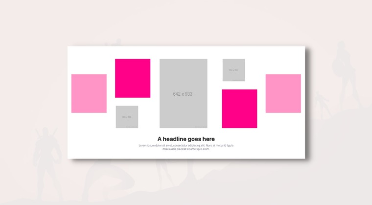

# Multi Image Centered

<figure><figcaption></figcaption></figure>

**Adding this Player Snip**

* [ ] On your [`My Player Snips Page`](../../how-to-guides.md#how-to-create-a-my-snips-page) add the **`PS-011`** section to your page
* [ ] **Open up the section's `Headings` settings group** and modify the text settings&#x20;
* [ ] Open the section's **`Image` settings group** and replace the placeholder images. The recommended image dimensions are shown in the image
* [ ] Optionally open the section's **`Color`** settings group and change the _Color Mode Option_ to `Custom` if you wish to control the color combinations
* [ ] Hover over the section and click the **`Copy Player Snip`** button
* [ ] In another tab **open your course curriculum** and find the lesson you wish to place this Player Snip into
* [ ] Put your cursor in the location that you wish to place this snippet&#x20;
* [ ] Open up the < > code viewer
* [ ] Paste the snippet
* [ ] Click the < > code button to return to the normal preview
* [ ] Click Save to save the lesson
* [ ] Preview the lesson inside the course player


The color of the list icon and accent colors around the images are automatically using the same "brand color" you have set for this course. It will be the same color you see for the complete and continue button.


##
