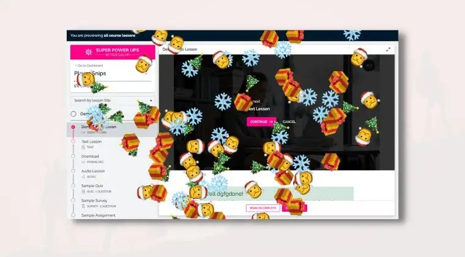

# Emoji Cannon

<figure><figcaption></figcaption></figure>

**Adding this Player Snip**

* [ ] On your [`My Player Snips Page`](../../how-to-guides.md#how-to-create-a-my-snips-page) add the **`ES-002`** section to your page
* [ ] **Open up the section's `Trigger` settings group** and choose if you want the effect to show when the lesson is completed or the lesson is started&#x20;
* [ ] Open the section's **`Emojis`** settings group and change the mode to Custom if you wish to control the emoji combinations or choose one of the included themes
* [ ] Open the **`Size and Quantity`** settings group and adjust how large the emojis should be as well as how many emojis should be shown
* [ ] Hover over the section and click on the **`Show Effect`** button to preview what the Player Snip will look like
* [ ] Hover over the section and click the **`Copy Player`**` ``Snip` button
* [ ] In another tab **open your course curriculum** and find the lesson you wish to place this Player Snip into
* [ ] Put your cursor in the location that you wish to place this snippet&#x20;
* [ ] Open up the < > code viewer
* [ ] Paste the snippet
* [ ] Click the < > code button to return to the normal preview
* [ ] Click Save to save the lesson
* [ ] Preview the lesson inside the course player


It is recommended to place this snippet at the bottom of the code view. When not in code view it is invisible and could potentially be removed by accident. Be sure be careful when editing content around this Player Snip


##

