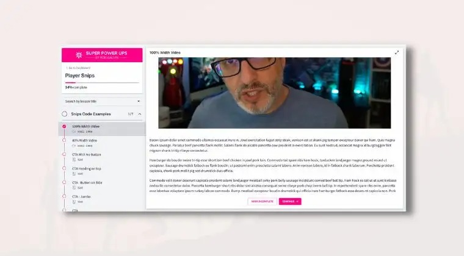

# 100% Content Width

<figure><figcaption></figcaption></figure>

**Adding this Player Snip**

* [ ] On your [`My Player Snips Page`](../../how-to-guides.md#how-to-create-a-my-snips-page) add the CL-001 section to your page
* [ ] Hover over the section and click the **`Copy Player Snip`** button
* [ ] In another tab open your course curriculum and find the lesson you wish to place this Player Snip into
* [ ] Open up the < > code viewer
* [ ] Paste the snip at the top of the code
* [ ] Click the < > code button to return to the normal preview
* [ ] Click Save to save the lesson
* [ ] Preview the lesson inside the course player

