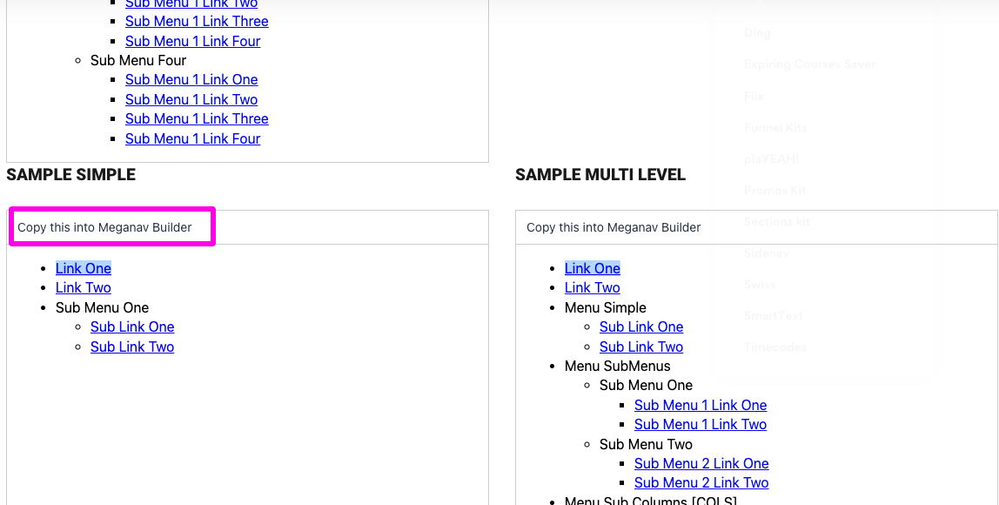

# ☑ Using MegaNav



### Getting Started&#x20;

* [ ] Log into the [SuperPowerUps.com member portal](https://www.superpowerups.com) and activate MegaNav from [the activation page](https://www.superpowerups.com/pages/meganav-install)
* [ ] Enter your Thinkific subdomain to access the [MegaNav Menu Builder](https://www.superpowerups.com/pages/meganav-menu-builder)
* [ ] Use the MegaNav Menu Builder to create a bullet list of links or menus and links
  * **Simple links:**Add your text and then highlight the text and add a link
  * **Simple menus:**Add your text for the menu and then indent one level and add your links
  * **Sub Menus:**Within a simple menu indent one level and create another simple menu with a label and sub links below it
  * **Sub Columns:**Create a label at the top level and add the text **\[COLS]** to it. Then each item below it must be a submenu (up to 5). You cannot put simple links below a Sub Column menu
* [ ] Click the Publish button when ready
* [ ] Paste the code snippet provided into one of your current Header links in the Text Field

### Important MegaNav Usage Notes

* Your bullet list must be "continuous". You should not include any blank lines between bullets
* You should not create anything more than "3 levels" deep
* Your logo will automatically be inserted into the MegaNav. The sizing of your logo will be automatic
* Your current Site Builder Header section will be replaced by the MegaNav. No settings will be used after the MegaNav is installed
* The MegaNav is purposely intended always be a sticky menu (remember our goal is to make your links quickly and easily accessible)
* Your color scheme will also typically be reused, but in some cases you may want to adjust it with the MegaNav custom color option

### Editing an Existing MegaNav Menu

.png>)

* [ ] Log into the [SuperPowerUps.com member portal](https://www.superpowerups.com) and activate MegaNav from [the activation page](https://www.superpowerups.com/pages/meganav-install)
* [ ] Enter your Thinkific subdomain to access the [MegaNav Menu Builder](https://www.superpowerups.com/pages/meganav-menu-builder)
* [ ] Copy your current MegaNav code snippet from your Header Link settings and paste it into the textbox on the right hand side of the MegaNav Menu builder page. Then click Sync
* [ ] Make your edits to the bullet list
* [ ] Click the Publish button when ready
* [ ] Paste the code snippet provided into one of your current Header links in the Text Field

### Using Custom Colors

In most cases MegaNav will automatically adapt to the color settings you have chosen for your Thinkific Header section. You can over-ride these colors by enabling the custom colors option

* [ ] Open MegaNav Menu builder as previously described.&#x20;
* [ ] Click the Use Custom Colors: checkbox and then choose your colors for the various settings
* [ ] Publish your MegaNav by following the previous instructions

### Using the Samples

On the MegaNav Menu Builder page, you will see a few sample menu's at the bottom of the page. Click the "Copy this Meganav Builder" button to set edit the sample

